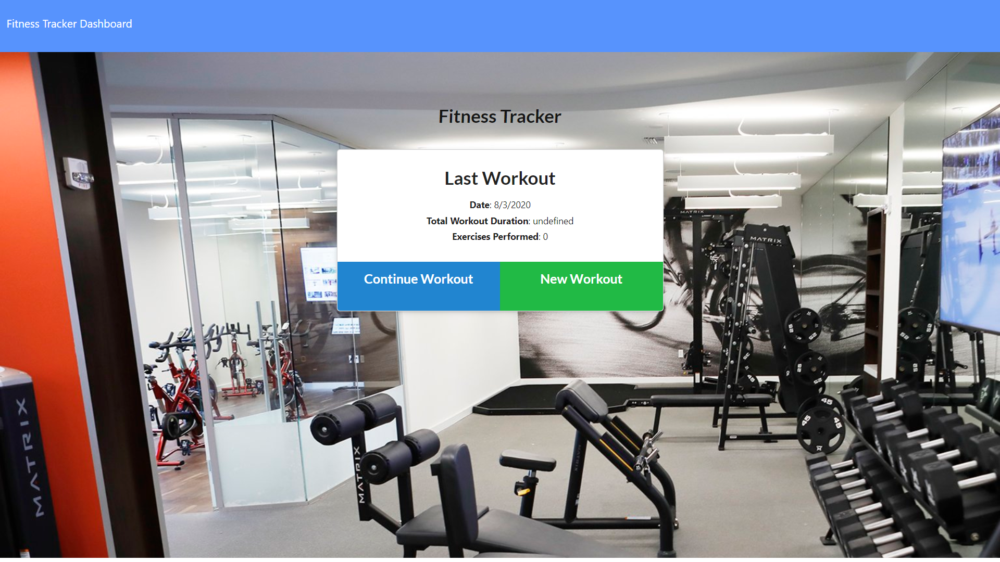

# Fitness tracker

## Description
As a developer I created a workout tracker application, the app will allow users to reach their fitness goals quicker when they track their workout progress. A user will be able to view, create and track daily workouts. Also, the user will be able to log multiple exercises in a workout on a given day and the user should also be able to track the name, type, weight, sets, reps, and duration of exercise. If the exercise is a cardio exercise, the user should be able to track his/her distance traveled.  the application uses MongoDB for its database, mongoose to create its schemas and express to handle routes. The Application allows user to see the last workout routine, to create new workout routines, to add exercises to a previous workout routine and users to see workout stats (charts).

## Screenshot 


## Directory structure
```
.
├── models
│   ├── index.js
│   └── workout.js
|
├── node_modules
│ 
├── public
│    ├── assets
│    │     └── images
│    │
│    ├── api.js
│    ├── exercise.html 
│    ├── exercise.js
│    ├── index.html
│    ├── index.js
│    ├── stats.html  
│    ├── stats.js
│    ├── style.css
│    ├── workout.js
│    └── workout-style.css
│
├── routes
│     ├── api.js
│     └── htmlRoutes.js  
│
├── seeders
│      └── seed.js
│
├── package.json
│
├── README.md
│
└── server.js    
```

## Link to deployed app
https://fitness-tracker-ucf2020.herokuapp.com/

## Badge


## License

MIT License

Copyright (c) [2020] [Michael Amaya]

Permission is hereby granted, free of charge, to any person obtaining a copy
of this software and associated documentation files (the "Software"), to deal
in the Software without restriction, including without limitation the rights
to use, copy, modify, merge, publish, distribute, sublicense, and/or sell
copies of the Software, and to permit persons to whom the Software is
furnished to do so, subject to the following conditions:

The above copyright notice and this permission notice shall be included in all
copies or substantial portions of the Software.

THE SOFTWARE IS PROVIDED "AS IS", WITHOUT WARRANTY OF ANY KIND, EXPRESS OR
IMPLIED, INCLUDING BUT NOT LIMITED TO THE WARRANTIES OF MERCHANTABILITY,
FITNESS FOR A PARTICULAR PURPOSE AND NONINFRINGEMENT. IN NO EVENT SHALL THE
AUTHORS OR COPYRIGHT HOLDERS BE LIABLE FOR ANY CLAIM, DAMAGES OR OTHER
LIABILITY, WHETHER IN AN ACTION OF CONTRACT, TORT OR OTHERWISE, ARISING FROM,
OUT OF OR IN CONNECTION WITH THE SOFTWARE OR THE USE OR OTHER DEALINGS IN THE
SOFTWARE.

## Contributing
[](code_of_conduct.md)